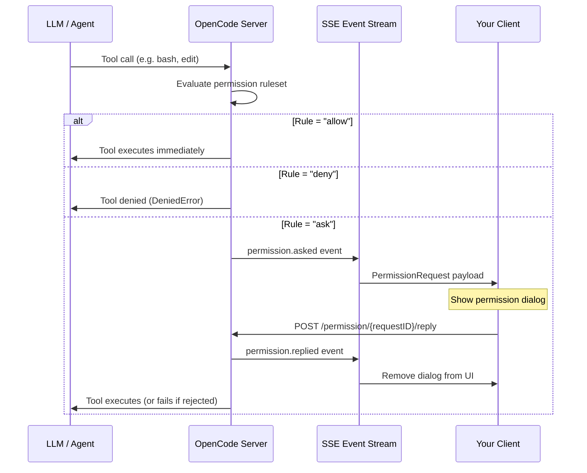
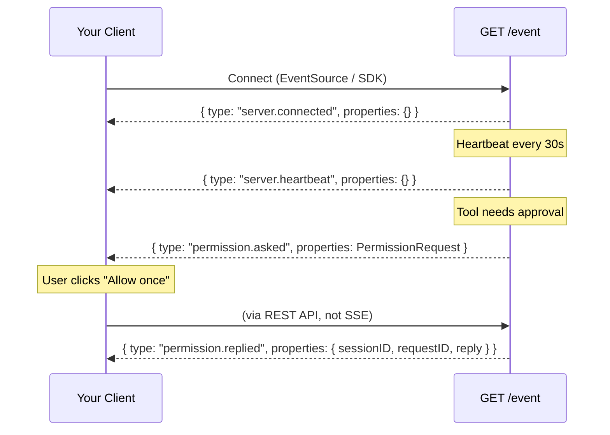
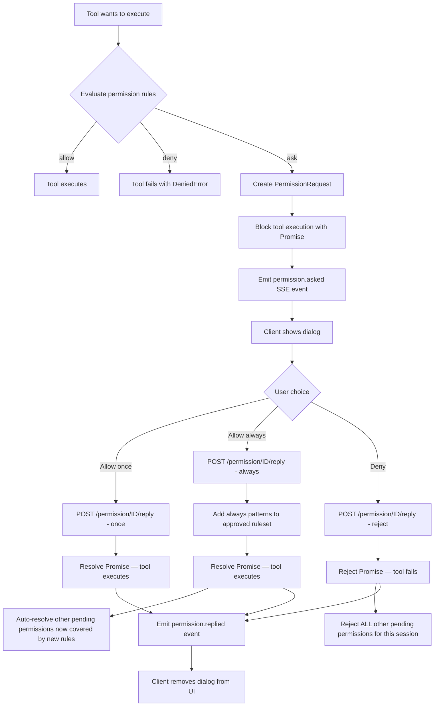

# OpenCode Permissions System — Client Implementation Guide

This document describes the runtime permissions protocol that custom OpenCode clients must implement to support the permission dialog (Allow once / Allow always / Deny).

## Architecture Overview



When a tool requires user approval, the server **blocks tool execution** and emits a `permission.asked` SSE event. The tool remains blocked until the client responds via the REST API. There is no timeout — the tool waits indefinitely.

---

## Types

All types below are available from `@opencode-ai/sdk` under the `v2` namespace:

```ts
import type { PermissionRequest, EventPermissionAsked, EventPermissionReplied } from "@opencode-ai/sdk/v2"
```

### PermissionRequest

The payload you receive when the server needs user approval.

```ts
type PermissionRequest = {
  id: string // Unique request ID (prefixed "per...")
  sessionID: string // Session that triggered the request
  permission: string // Permission type: "edit", "bash", "read", "glob",
  //   "grep", "list", "task", "external_directory",
  //   "webfetch", "websearch", "codesearch", "lsp",
  //   "todowrite", "todoread", "skill", "doom_loop",
  //   or any MCP tool name
  patterns: string[] // What is being requested (file paths, commands, URLs)
  metadata: Record<string, unknown>
  // Tool-specific context. For "edit" permissions this
  // includes `filepath` and `diff`. Other tools may
  // include different metadata.
  always: string[] // Patterns that would be permanently allowed if the
  // user chooses "Allow always"
  tool?: {
    // Links the request to the specific tool call
    messageID: string //   in the message stream
    callID: string
  }
}
```

### SSE Events

Two event types are relevant:

```ts
type EventPermissionAsked = {
  type: "permission.asked"
  properties: PermissionRequest
}

type EventPermissionReplied = {
  type: "permission.replied"
  properties: {
    sessionID: string
    requestID: string
    reply: "once" | "always" | "reject"
  }
}
```

### Reply Values

| Value      | Meaning                                                                |
| ---------- | ---------------------------------------------------------------------- |
| `"once"`   | Allow this specific tool call. No persistent rule is created.          |
| `"always"` | Allow this tool call AND add the `always` patterns as permanent rules. |
| `"reject"` | Deny this tool call. Optionally include a `message` with guidance.     |

---

## SSE Event Stream

Connect to the SSE stream at `GET /event` (the SDK handles this via `client.event`). The stream emits all bus events as JSON-encoded `data` fields.



### Subscribing with the SDK

```ts
import { createClient } from "@opencode-ai/sdk/v2"

const client = createClient({ baseUrl: "http://localhost:PORT" })

// Listen for all events
client.event.on("permission.asked", (event) => {
  const request: PermissionRequest = event.properties
  // Store request, show UI
})

client.event.on("permission.replied", (event) => {
  const { sessionID, requestID, reply } = event.properties
  // Remove request from UI state
})
```

---

## REST API

### Reply to a Permission Request

**`POST /permission/{requestID}/reply`**

This is the primary endpoint. Called when the user makes a choice in the permission dialog.

```ts
// Using the SDK
await client.permission.reply({
  requestID: permissionRequest.id,
  reply: "once" | "always" | "reject",
  message: "optional feedback when rejecting",
})
```

| Field       | Type                             | Required | Description                                     |
| ----------- | -------------------------------- | -------- | ----------------------------------------------- |
| `requestID` | `string`                         | Yes      | The `id` from the `PermissionRequest`           |
| `reply`     | `"once" \| "always" \| "reject"` | Yes      | The user's decision                             |
| `message`   | `string`                         | No       | Feedback text (only meaningful with `"reject"`) |

**Response:** `200 OK` with body `true`.

The `message` field is useful for "reject with guidance" — if the user rejects a tool call but wants to tell the agent what to do instead, include the message. The server wraps it as a `CorrectedError` and passes it back to the LLM.

### List Pending Permissions

**`GET /permission`**

Returns all currently pending `PermissionRequest[]` across all sessions. Use this on startup to recover any permissions that were asked before your client connected.

```ts
const { data } = await client.permission.list()
// data: PermissionRequest[]
```

---

## Client Implementation Guide

### State Management

Your client needs to maintain a map of pending permissions per session:

```ts
// Recommended state shape
type PermissionState = {
  [sessionID: string]: PermissionRequest[]
}
```

### Required Behaviors

#### 1. Subscribe to events on startup

Connect to the SSE stream and handle both `permission.asked` and `permission.replied` events.

#### 2. Hydrate pending permissions on connect

After connecting, call `client.permission.list()` to fetch any permissions that were requested before your client connected. Merge these into your state.

#### 3. Show one permission at a time per session

Only display the **first** pending permission for a session. Permissions are ordered — the tool execution pipeline is blocked sequentially. Process them one at a time.

#### 4. Match permissions to tool calls

Use `permissionRequest.tool.callID` to visually associate the permission dialog with the correct tool call in your message stream. This lets users see exactly which tool is asking for permission.

#### 5. Render three action buttons

| Button           | SDK call                                                     | UX guidance             |
| ---------------- | ------------------------------------------------------------ | ----------------------- |
| **Allow once**   | `reply({ requestID, reply: "once" })`                        | Primary action          |
| **Allow always** | `reply({ requestID, reply: "always" })`                      | Secondary action        |
| **Deny**         | `reply({ requestID, reply: "reject", message?: userInput })` | Destructive/ghost style |

#### 6. Show contextual info from metadata

For `"edit"` permissions, `metadata.diff` contains a unified diff string — render it as a diff view. For `"bash"` permissions, `patterns` contains the commands being run. For `"external_directory"`, `patterns` contains the directory globs.

#### 7. Disable input while permission is pending

While a permission is pending for the active session, disable the user input field. The agent loop is blocked and cannot accept new messages until the permission is resolved.

#### 8. Handle child session permissions

If your client supports subtasks/child sessions (the `task` tool), permissions from child sessions need to bubble up to the parent session's UI. When a child session emits a `permission.asked` event, your client should display it in the parent session's context. Track permissions across all child session IDs.

#### 9. Handle the `permission.replied` event

When you receive `permission.replied`, remove the matching permission from your state. This event fires even for permissions your client replied to — treat it as the authoritative signal to dismiss the dialog.

This is important because another client instance could reply to the same permission. Your client should always react to `permission.replied` regardless of whether it sent the reply.

---

## Detailed Flow



### Key Behaviors

**Cascading reject:** When a user rejects a permission, the server also rejects **all** other pending permissions for the same session. Your client will receive multiple `permission.replied` events (one per rejected request). This is intentional — a rejection signals the user wants to interrupt the current execution flow.

**Cascading allow-always:** When a user chooses "Allow always", the server adds the `always` patterns as permanent rules for the session, then checks all other pending permissions for the same session. Any that are now covered by the new rules are automatically resolved. Your client will receive `permission.replied` events for those too.

**Reject with message:** When `reply` is `"reject"` and a `message` is provided, the server wraps it as a `CorrectedError` instead of a `RejectedError`. The LLM receives the user's feedback and can adjust its approach. This is useful for guiding the agent without halting the conversation entirely.

**No persistent storage yet:** "Allow always" currently persists rules in memory for the lifetime of the OpenCode server instance. Rules are not yet saved to disk between restarts (this is noted as a TODO in the codebase).

---

## Permission Types Reference

These are the `permission` strings your client will encounter in `PermissionRequest.permission`:

| Permission             | Triggered by                                   | `patterns` contain      |
| ---------------------- | ---------------------------------------------- | ----------------------- |
| `"edit"`               | write, edit, apply_patch tools                 | Relative file paths     |
| `"bash"`               | bash tool                                      | Shell commands          |
| `"read"`               | read tool                                      | File paths              |
| `"glob"`               | glob tool                                      | Glob patterns           |
| `"grep"`               | grep tool                                      | Search patterns         |
| `"list"`               | ls tool                                        | Directory paths         |
| `"task"`               | task (sub-agent) tool                          | Task descriptions       |
| `"external_directory"` | bash/tools accessing dirs outside project      | Directory glob patterns |
| `"webfetch"`           | webfetch tool                                  | URLs                    |
| `"websearch"`          | websearch tool                                 | Search queries          |
| `"codesearch"`         | codesearch tool                                | Search queries          |
| `"lsp"`                | LSP tool                                       | LSP operation patterns  |
| `"todowrite"`          | todo write tool                                | `["*"]`                 |
| `"todoread"`           | todo read tool                                 | `["*"]`                 |
| `"skill"`              | skill tool                                     | Skill names             |
| `"doom_loop"`          | Doom loop detector (same tool called 3+ times) | Tool call patterns      |
| `"<mcp_tool_name>"`    | Any MCP server tool                            | Tool-specific patterns  |

---

## Minimal Example

```ts
import { createClient } from "@opencode-ai/sdk/v2"
import type { PermissionRequest } from "@opencode-ai/sdk/v2"

const sdk = createClient({ baseUrl: "http://localhost:3000" })

// State
const pending: Record<string, PermissionRequest[]> = {}

// Hydrate on connect
const { data: existing } = await sdk.permission.list()
for (const req of existing ?? []) {
  pending[req.sessionID] ??= []
  pending[req.sessionID].push(req)
}

// Subscribe to events
sdk.event.on("permission.asked", (event) => {
  const req = event.properties
  pending[req.sessionID] ??= []
  pending[req.sessionID].push(req)
  renderPermissionDialog(req)
})

sdk.event.on("permission.replied", (event) => {
  const { sessionID, requestID } = event.properties
  if (pending[sessionID]) {
    pending[sessionID] = pending[sessionID].filter((r) => r.id !== requestID)
  }
  dismissPermissionDialog(requestID)
})

// User actions
async function allowOnce(req: PermissionRequest) {
  await sdk.permission.reply({ requestID: req.id, reply: "once" })
}

async function allowAlways(req: PermissionRequest) {
  await sdk.permission.reply({ requestID: req.id, reply: "always" })
}

async function deny(req: PermissionRequest, feedback?: string) {
  await sdk.permission.reply({
    requestID: req.id,
    reply: "reject",
    message: feedback,
  })
}
```

---

## Deprecated API

The older endpoint `POST /session/{sessionID}/permissions/{permissionID}` (SDK: `client.permission.respond()`) still works but is deprecated. Use `client.permission.reply()` instead — it supports the `message` field for rejection feedback and uses a simpler URL scheme.
